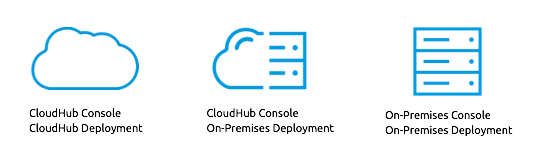

= CloudHub and Anypoint Runtime Manager
:keywords: cloudhub, cloud, api

////
The Anypoint Runtime Manager offers you several different ways to deploy your Mule applications. You can:

* Deploy your applications through the Anypoint Runtime Manager Console link:anypoint.mulesoft.com[online] to *CloudHub*
* Deploy your applications through the Anypoint Runtime Manager Console link:anypoint.mulesoft.com[online] to *a server you manage*
* Deploy your applications through the Anypoint Runtime Manager Console link:/anypoint-platform-on-premises/[on premises] to *a server you manage*

image:

These different modalities offer different management features. The key reason behind these differences is that both use a different link:/mule-agent/[Mule Agent] in their communication to the servers.
* When deploying to CloudHub, the old agent is used. This agent was originally created for link:/mule-management-console/[MMC].
* When deploying to a server you manage, regardless of if you do this through the cloud or the on-premises Runtime Manager console, the new link:/mule-agent/[Mule Agent] is used.
////

CloudHub and the Anypoint Runtime Manager offer you several different ways to deploy your Mule applications. You can:

* Deploy your applications through the link:anypoint.mulesoft.com[CloudHub] console to a *CloudHub* worker
* Deploy your applications through the link:anypoint.mulesoft.com[CloudHub] console to *a server you manage* (which may be on premises or in a different cloud server)
* Deploy your applications through the Anypoint Runtime Manager Console link:/anypoint-platform-on-premises/[on premises] to *a server you manage* (which may be on premises or in a different cloud server)

CloudHub is a full Platform As A Service that covers all of your server needs out of the box, including logging, analytics, alerts, scheduling, etc. Hosting your apps on your own servers allows for greater flexibility and tighter security (in case you deploy to your own secured on-premises environment) but requires that you sort out several considerations by your own means. You can group your servers into Server Groups or Clusters and configure various parameters regarding them.

== Management Features

These different modalities offer different management features. The key reason behind these differences is that both use a different link:/mule-agent/[Mule Agent] in their communication to the servers.

image:arm-vs-ch2.png[diagram1]

* When deploying to a CloudHub worker, the old agent is used. (this is the same agent used by link:/mule-management-console/[MMC])
* When deploying to a server you manage, regardless of if you do this through CloudHub or the on-premises Runtime Manager console, the new link:/mule-agent/[Mule Agent] is used.

Although the long term plan is to converge the features of these deployment scenarios so that they all offer the same capabilities, currently they have the following differences:

[cols="50%,50%", options="header"]
|===
Deploying to a CloudHub worker | Deploying to a server you manage |
link:/cloudhub/logs[Logs are handled] by CloudHub | You can configure CloudHub or the Anypoint Runtime Manager to send data link:cloudhub/sending-data-from-arm-to-external-monitoring-software[to External Monitoring Software] such as Splunk or ELK|
CloudHub has its own link:/cloudhub/cloudhub-insight[Insight Engine]| You can configure CloudHub or the Anypoint Runtime Manager to send data link:cloudhub/sending-data-from-arm-to-external-monitoring-software[to External Monitoring Software] such as Splunk or ELK|
You can manage link:/cloudhub/managing-schedules[Schedules] through the CloudHub UI | You must use the link:/mule-user-guide/v/3.7/poll-schedulers[Poll Scheduler] element in your flows to schedule tasks |
CloudHub has its own preconfigured default link:/cloudhub/managing-application-data-with-object-stores[Object Store] you can reference. To use it, simply add an link:/mule-user-guide/v/3.7/mule-object-stores[Object Store connector] and set its 'config_ref' to point to the default CloudHub Object Store.|
To use link:/mule-user-guide/v/3.7/mule-object-stores[Object Stores] you must configure your own database to store data |
You can manage link:/cloudhub/alerts-and-notifications[Alerts and Notifications] through the CloudHub UI  | You must build alerts and notifications into the logic of your flows |
|===

== Shared Resource Support

link:/mule-user-guide/v/3.7/shared-resources[Domains] in Mule offer you the possibility of reusing configurations amongst several applications.

Since every application in CloudHub is already running on its own separate virtual server, no domains are needed when deploying to CloudHub.

Currently, you can't deploy domains through the CloudHub console, even to external servers where they could be needed in some scenarios. In those cases, you can still deploy your domains manually directly on your local server through the command line.

////
== Migrating from CloudHub to an On-Prem Scenario

consider that certain things may need to be configured for your local firewall
////

== See Also

* link:/cloudhub/managing-cloudhub-applications[Managing CloudHub Applications]
* link:/mule-fundamentals/v/3.7/elements-in-a-mule-flow[Elements in a Mule Flow]
