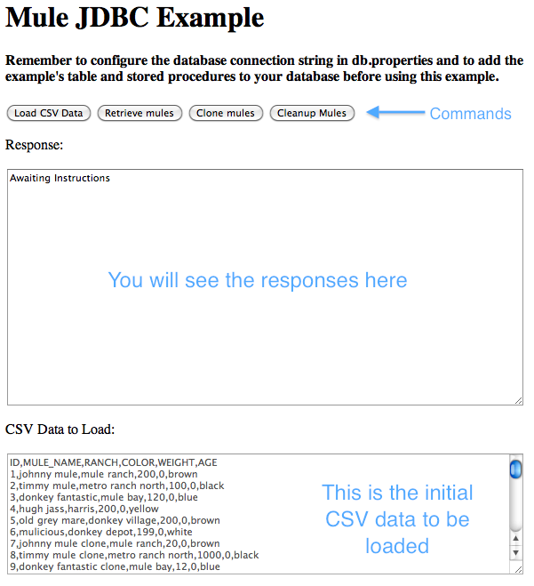
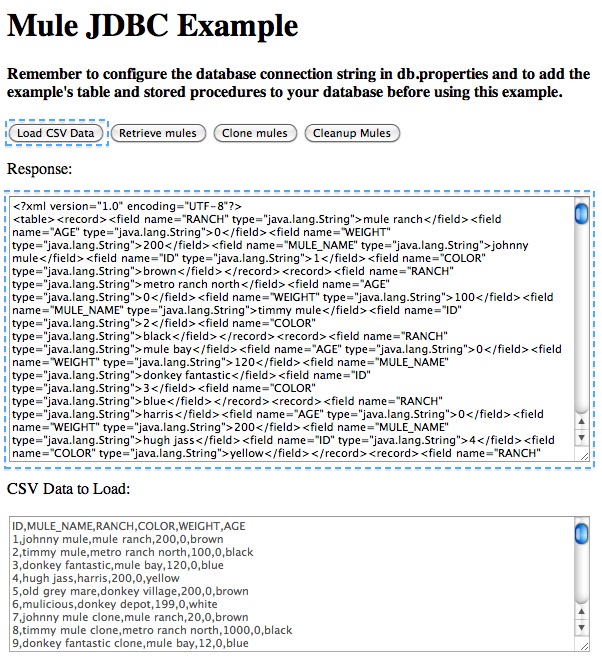
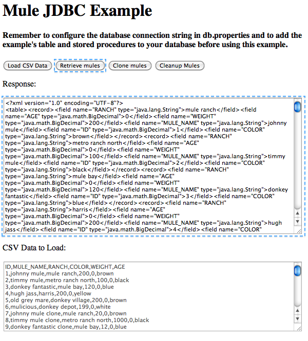
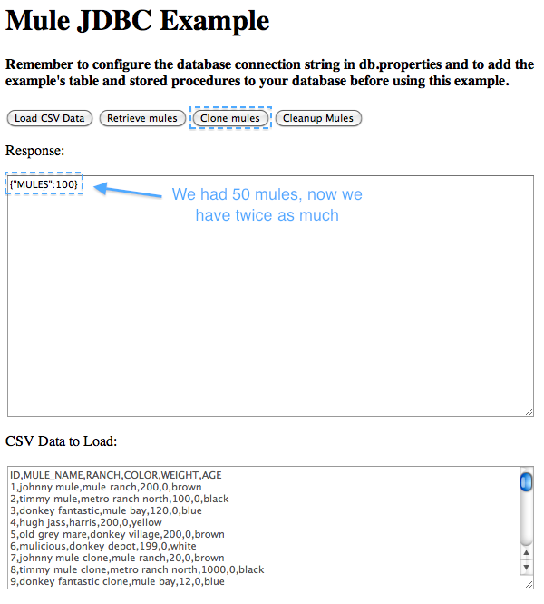
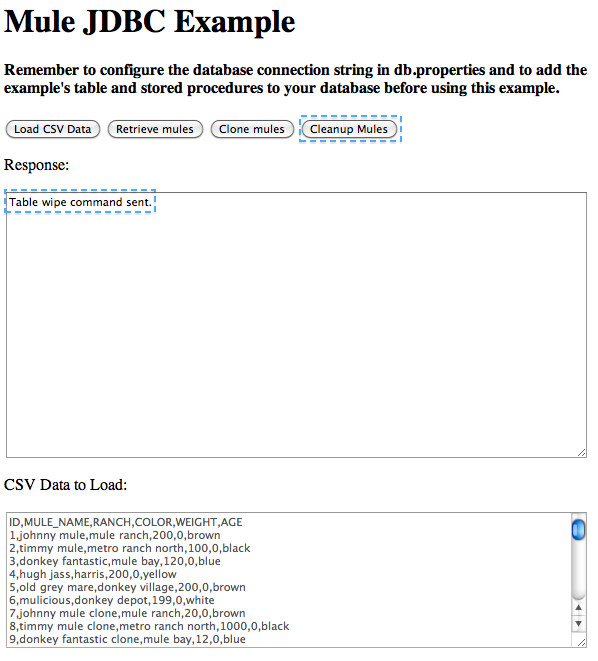

= JDBC Transport Example

1 link:#JDBCTransportExample-SetupJDBCExample[Setup JDBC Example]

2 link:#JDBCTransportExample-Runtheexample[Run the example]

* 2.1 link:#JDBCTransportExample-InsertDatafromCSVinput[Insert Data from CSV input]
* 2.2 link:#JDBCTransportExample-RetrieveCountfromtheDB[Retrieve Count from the DB]
* 2.3 link:#JDBCTransportExample-CloneObjects[Clone Objects]
* 2.4 link:#JDBCTransportExample-WipeDatafromtheDatabase[Wipe Data from the Database]

This page describes the examples you can run for the Mule Enterprise JDBC transport. These examples are designed to work with Oracle and Sybase databases.

For a more complete list of Mule JDBC capabilities, please visit the link:/documentation-3.2/display/32X/JDBC+Transport+Reference[JDBC Transport Reference] page.

== Setup JDBC Example

The Mule Enterprise JDBC Examples are located in your installation at $MULE_HOME/examples/jdbc.

. Within $MULE_HOME/examples/jdbc/scripts you will find two directories, one for Oracle and one for Sybase.
. Run the tables.ddl script (located in the after-mentioned directory) to create the necessary table in your database.
. Run the procs.ddl script located in the after-mentioned directory) to create the necessary stored procedures in your database.
. Copy your database driver to your $MULE_HOME/lib/user directory.
. Copy the pre-built application archive (mule-example-jdbc.zip) to the application folder ($MULE_HOME/apps).
. Start Mule.
. Edit the apps/mule-example-jdbc/classes/db.properties file to set up your database connection configuration. +
NOTE: If you needed to change something in db.properties, restart mule or just "touch $MULE_HOME/apps/mule-example-jdbc/mule-config.xml" (in UN*X).

== Run the example

To access the web service enter http://localhost:8084/services/jdbc from your browser.

You will see a row of buttons to send commands, a response window and a CSV list of mules to upload.

=== Insert Data from CSV input

Click "Load CSV data".

You will see an XML output displaying the information on the uploaded mules.

If you try to click the button more than once, you will receive an exception caused by a primary key violation.

image:Screen+shot+03.png[Screen+shot+03]

=== Retrieve Count from the DB

Click "Retrieve mules"

You will see an XML output containing the mules stored in the DB table

=== Clone Objects

Click "Clone mules"

You will see the number of mules after the cloning process

Try clicking "Clone mules" again a couple of times and see the number grow.

image:Screen+shot+06.png[Screen+shot+06]

Verify the growth of the population clicking "Retrieve mules"

image:Screen+shot+07.png[Screen+shot+07]

=== Wipe Data from the Database

Click "Cleanup Mules"

You will receive confirmation that the command has been sent

Verify there are no more mules clicking "Retrieve mules"

image:Screen+shot+09.png[Screen+shot+09]

[cols=",",]
|===
|image:information.png[information] |There is really no need to follow this steps in this predefined order. You are welcome to play with this.

|===
