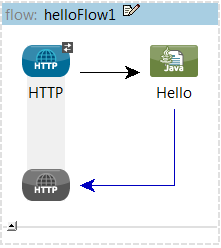
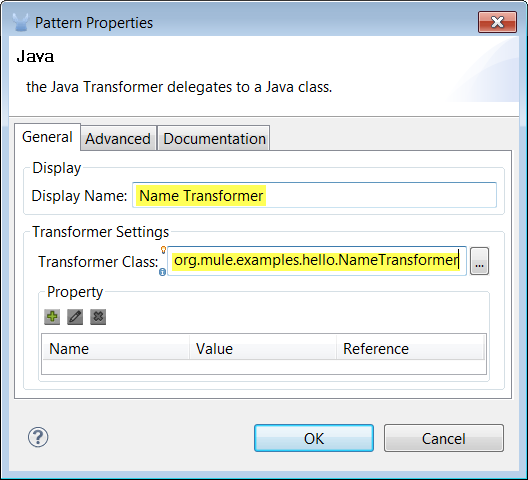

= Transforming Data in a Flow

This example shows how to use a custom transformer. In this case, a simple transformer is used in a flow to alter information received in an HTTP request before passing the information to a custom component.

== What you Will Learn

* How to create a Custom Transformer in Mule Studio.
* How to configure the Transformer in the flow.
* How to implement a Custom Transformer.

* http://www.youtube.com/watch?v=qzv4uG2zHF8
image:http://www.mulesoft.org/documentation/download/attachments/51053656/working-with-transformers-flow-100.png[image]]
*Watch a video*

See this example built and run in Mule Studio

10 minutes

= Build it Now!

== Prerequisites

This examples requires that you run through the example described in link:/documentation-3.2/display/32X/Adding+Business+Logic+to+a+Flow[Adding Business Logic to a Flow].

== Building the Example

\1. Let's begin with the "Hello" flow you built in link:/documentation-3.2/display/32X/Adding+Business+Logic+to+a+Flow[Adding Business Logic to a Flow]. Run it and confirm in a browser window that when you go to http://localhost:8082/Fred you see the following on screen:

image:studioBrowserOutputInitial.png[studioBrowserOutputInitial]

Now, wouldn't it be nice to remove that slash before the name? A Custom Transformer can take care of that.

\2. Create a new class in the org.mulesoft.example.hello package

image:studioAddNewClass.png[studioAddNewClass]

\3. Name it NameTransformer, and make it extend AbstractTransformer

image:studioConfigureTransformerClass.png[studioConfigureTransformerClass]

\4. Implement it as follows. It will detect Strings beginning with a slash and remove it. Otherwise, it will return the original object.

image:studioTransformerCode.png[studioTransformerCode]

\5. Open your flow. It should look like this:

\6. Insert a Java Transformer. Do so by dragging it from the sidebar and dropping it between the HTTP Inbound Endpoint and the Hello Component.

[cols=",",]
|===
|image:information.png[information] |In previous Studio versions, the Java Transformer was named *Custom Transformer*.

|===

image:studioAddTransformerComponent.png[studioAddTransformerComponent]

\7. Double-click on the Transformer you just inserted and insert the full name of the Transformer class we just implemented. You may also want to add some additional documentation information. Click OK when you are done and save the flow.

image:studioConfigureTransformerComponentDoc.png[studioConfigureTransformerComponentDoc]

== Running the Example

\8. Run as Mule Application (as you did in the previous examples).

\9. Open a browser window and go to http://localhost:8082/Fred. Notice that this time the greeting does not contain a slash:

image:studioBrowserOutputFinal.png[studioBrowserOutputFinal]

== What Just Happened?

* You created a Custom transformer and plugged it into the flow.
* Your HTTP request payload was processed by the Transformer before passing it to the Component.
* The HTTP Endpoint, the Transformer and the Component don't know about each other. Mule connects them as necessary.

== References

* link:/documentation-3.2/display/32X/Using+Transformers[Using Transformers]
* link:/documentation-3.2/display/32X/Creating+Custom+Transformers[Creating Custom Transformers]
* link:/documentation-3.2/display/32X/Creating+Custom+Transformer+Class[Creating Custom Transformer Class]

== Next Steps

[cols=",,",]
|===
|http://www.mulesoft.org/display/32X/Filtering+Invalid+Requests[« Filtering Invalid Requests] |http://www.mulesoft.org/display/32X/Home[Back to Index] |http://www.mulesoft.org/display/32X/Invoking+Component+Methods[Invoking Component Methods »]
|===

'''''

