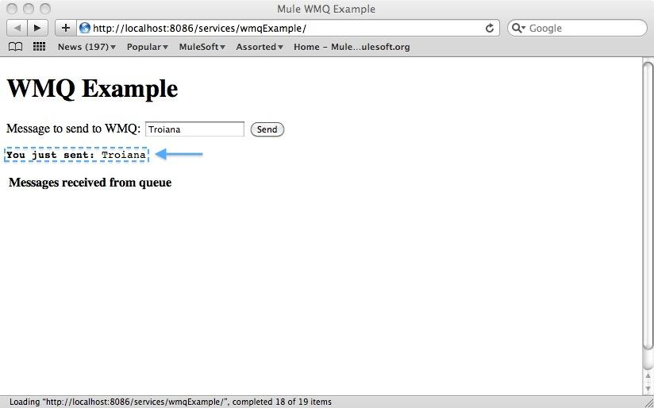
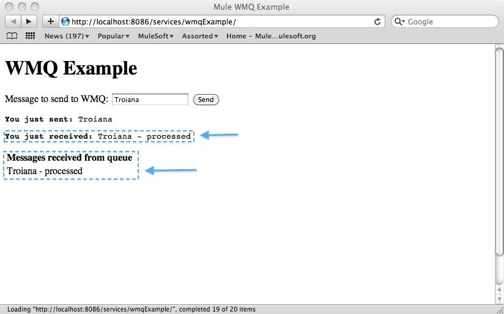

= WebSphere MQ Example _*Enterprise Edition*_

The WebSphere MQ example demonstrates using Mule's link:/documentation-3.2/display/32X/Mule+WMQ+Transport+Reference[transport for WebSphere MQ] to send and receive transactional messages to WebSphere MQ. This example is available in the enterprise edition of Mule.

=== Prerequisites

Before you can run the example, ensure the following:

* Mule enterprise 3.1 or later is installed.
* WebSphere MQ 6 or 7 is installed.
* The WebSphere MQ client JARs are available to you.

=== Installing the example

. Copy your WebSphere MQ client JARs to your `$MULE_HOME/lib/user` directory.
. Make sure your WebSphere MQ installation has queues named "in" and +
"out" created.
. Copy the example's zip file into the $MULE_HOME/apps directory.
. Start Mule and wait for it to install the example. You may see some exceptions,since the WMQ has not been configured yet. We will do so in the next step.
. Now you need to edit the following properties in `$MULE_HOME/apps/mule-example-wmq/classes/wmq.properties` to reflect your WebSphere MQ installation:
+
code,code-java----
 code,code-java
wmq.host=wmq.port=wmq.queue.manager=wmq.username=wmq.password=
----

. Restart Mule.

=== Running the example

In this part of the example we will demonstrate the basic usage, sending text messages and retrieving them from a WMQ using Mule.

. After mule starts up, open the following URL in your browser http://localhost:8086/services/wmqExample. 
+
image:WMQ+01.jpeg[WMQ+01]
+

. You are prompted to enter text to send a message to WebSphere MQ. Your input will be transmitted via AJAX/WMQ to the "in" queue and you will receive confirmation that your message has been submitted. Try entering some text and hit "Send". 
+

+

. The messages sent to the "in" queue will be processed and an intentional 15 second delay will be introduced before sending them back to you via the "out" queue and WMQ/AJAX. You will be notified when the message is received and its content will be added to the table below. 
+

+

. Play with it! Start typing several messages in the text box and hit "Send" to submit them to Mule via AJAX/WMQ. After 15 seconds of intentional delay, the messages will be sent back to you. 
+
image:WMQ+05.jpeg[WMQ+05]
+

For more information, see http://www.mulesoft.org/display/MULE3USER/Mule+WMQ+Transport[Mule WMQ transport] in the Mule User's Guide.

image:loading_mini.png[loading_mini]image:rater.png[rater]

Your Rating:

Thanks for voting!

link:/documentation-3.2/plugins/rate/rating.action?decorator=none&displayFilter.includeCookies=true&displayFilter.includeUsers=true&ceoId=29097990&rating=1&redirect=true[image:blank.png[blank]]link:/documentation-3.2/plugins/rate/rating.action?decorator=none&displayFilter.includeCookies=true&displayFilter.includeUsers=true&ceoId=29097990&rating=2&redirect=true[image:blank.png[blank]]link:/documentation-3.2/plugins/rate/rating.action?decorator=none&displayFilter.includeCookies=true&displayFilter.includeUsers=true&ceoId=29097990&rating=3&redirect=true[image:blank.png[blank]]link:/documentation-3.2/plugins/rate/rating.action?decorator=none&displayFilter.includeCookies=true&displayFilter.includeUsers=true&ceoId=29097990&rating=4&redirect=true[image:blank.png[blank]]link:/documentation-3.2/plugins/rate/rating.action?decorator=none&displayFilter.includeCookies=true&displayFilter.includeUsers=true&ceoId=29097990&rating=5&redirect=true[image:blank.png[blank]]

image:/documentation-3.2/download/resources/com.adaptavist.confluence.rate:rate/resources/themes/v2/gfx/blank.gif[Please Wait,title="Please Wait"]

Please Wait

Results:

image:/documentation-3.2/download/resources/com.adaptavist.confluence.rate:rate/resources/themes/v2/gfx/blank.gif[Pathetic,title="Pathetic"]image:/documentation-3.2/download/resources/com.adaptavist.confluence.rate:rate/resources/themes/v2/gfx/blank.gif[Bad,title="Bad"]image:/documentation-3.2/download/resources/com.adaptavist.confluence.rate:rate/resources/themes/v2/gfx/blank.gif[OK,title="OK"]image:/documentation-3.2/download/resources/com.adaptavist.confluence.rate:rate/resources/themes/v2/gfx/blank.gif[Good,title="Good"]image:/documentation-3.2/download/resources/com.adaptavist.confluence.rate:rate/resources/themes/v2/gfx/blank.gif[Outstanding!,title="Outstanding!"]

21

rates
